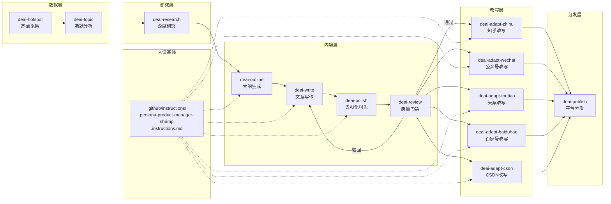
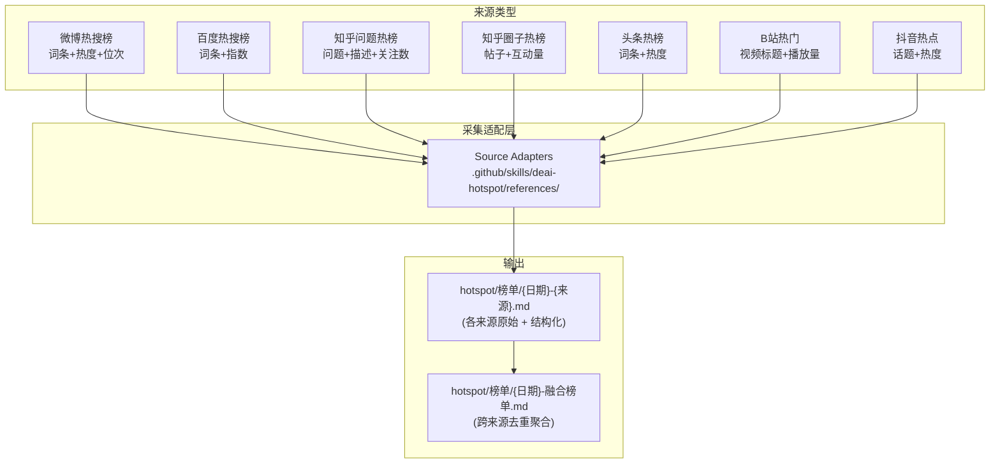

# 自媒体 Skill 体系设计方案

> 基于原《自媒体全自动写作、分发工作流设计方案》的优化迭代
> 原则：① VS Code Skill 化，人机协同半自动 ② 全程贯穿去 AI 化

---

## 一、设计理念对比

| 维度 | 原方案（自动化系统） | 现方案（Skill 体系） |
| ---- | -------------------- | -------------------- |
| 运行环境 | Python 后端 + 云服务器 | VS Code + GitHub Copilot |
| 调度方式 | APScheduler 定时器 | 人工按需调用 Skill |
| 数据存储 | SQLite/PostgreSQL | Markdown/JSON 文件 |
| 管理界面 | FastAPI Web 后台 | VS Code 文件系统 |
| 质量把控 | 自动化门禁 + 可选人工 | 人工在关键节点把控 |
| 去 AI 化 | 依赖 Prompt 约束 | Prompt 约束 + 专项润色 Skill + 人设基线 |
| 上手成本 | 需要搭建完整技术栈 | 零成本，有 VS Code 即可开始 |
| 迭代方式 | 整体部署 | 每个 Skill 独立优化 |

---

## 附：VS Code 自定义文件目录规范

本方案遵循 VS Code 对 Copilot 自定义文件的标准目录结构：

| 文件类型 | 路径规则 | 文件名示例 | 说明 |
| -------- | -------- | ---------- | ---- |
| 全局指令 | `.github/copilot-instructions.md` | `copilot-instructions.md` | Always-on，每次对话自动加载 |
| 文件指令 | `.github/instructions/*.instructions.md` | `persona-product-manager-shrimp.instructions.md` | On-demand，通过 `description` 匹配触发 |
| Skill | `.github/skills/<name>/SKILL.md` | `.github/skills/deai-write/SKILL.md` | 按需加载的工作流，文件夹名 `name` 必须匹配 YAML `name` 字段 |
| Skill 引用文件 | `.github/skills/<name>/references/` | `references/adapter-weibo.md` | 被 SKILL.md 通过相对路径 `./references/` 引用 |
| Skill 脚本 | `.github/skills/<name>/scripts/` | `scripts/validate.sh` | 可执行脚本，被 SKILL.md 引用 |
| Prompt | `.github/prompts/*.prompt.md` | `xxx.prompt.md` | 单步参数化任务，显示为 `/` 斜杠命令 |
| 自定义 Agent | `.github/agents/*.agent.md` | `xxx.agent.md` | 自定义子 Agent，可限制工具集 |
| 生命周期钩子 | `.github/hooks/*.json` | `pre-tool.json` | 在 Agent 生命周期节点确定性执行命令 |

> Skill 与 Prompt 的区别：多步骤工作流 + 附带脚本/引用文件 → Skill。单步参数化任务 → Prompt。
> 本方案所有工作流步骤均使用 Skill 类型（因涉及引用文件和完整流程）。

---

## 二、工作流总览

### 2.1 全链路



### 2.2 Skill 全景

```text
                            Skill 体系（9+1）

 数据层     研究层     内容层                  质量层        改写层           分发层
 ┌────────┐ ┌────────┐ ┌────────┐ ┌─────────┐ ┌────────┐ ┌───────────┐   ┌──────────┐
 │hotspot │→│topic   │→│research│→│outline  │→│write   │→│polish     │
 │热点采集 │ │选题分析│ │深度研究│ │大纲生成 │ │文章写作│ │去AI化     │
 └────────┘ └────────┘ └────────┘ └────────┘ └────────┘ │润色      │
                                                         └─────────┘
                                                              ↓
                                                         ┌──────────┐
                                                         │review    │──→   adapt-zhihu
                                                         │质量门禁  │       adapt-wechat
                                                         └──────────┘       adapt-toutiao
                                                              ↓            adapt-baiduhao
                                                         ┌──────────┐       adapt-csdn
                                                         │publish   │
                                                         │平台分发   │       └──────────┘
                                                         └──────────┘

 存放位置：.github/instructions/      # VS Code 标准路径
 人设基线：.github/instructions/persona-product-manager-shrimp.instructions.md
 └── 被 research / outline / write / polish / adapt-* 六个 Skill 引用
```

---

## 三、Skill 详细设计

### 3.1 `deai-hotspot` — 热点采集

| 项目 | 说明 |
| ---- | ---- |
| 文件名 | `.github/skills/deai-hotspot/SKILL.md` |
| 职责 | 从多个来源类型拉取热点数据，统一结构化后去重排序，输出标准化榜单 |
| 输入 | 用户指定来源类型（默认全量采集） |
| 输出 | `hotspot/榜单/{日期}-{来源类型}.md`（各来源原始数据）+ `hotspot/榜单/{日期}-融合榜单.md`（聚合后） |
| 去AI化 | 不涉及，数据客观采集 |
| 触发方式 | `@deai-hotspot` |
| 依赖 Skill | 无 |

#### 多来源架构

不同来源的数据结构不同，需要按"来源类型"分别适配：



**各来源数据结构差异：**

| 来源类型 | 包含字段 | 示例 | 说明 |
| -------- | -------- | ---- | ---- |
| 微博热搜榜 | 词条、热度值、在位时长、话题链接 | #某某某# 热度 2,350,000 | 实时社会热点，更新最快 |
| 百度热搜榜 | 词条、指数、简述 | 某某某 指数 1,200,000 | 搜索热度，反映主动关注 |
| 知乎问题热榜 | 问题标题、问题描述、关注数、回答数 | "如何看待……？" 关注 5,200 | 长文讨论场景，适合深度选题 |
| 知乎想法热榜 | 帖子摘要、互动量 | 某某某 互动 3,800 | 短内容，适合快评 |
| 头条热榜 | 词条、热度值、来源媒体 | 某某某 热度 800,000 | 资讯分发热度 |
| B站热门 | 视频标题、播放量、弹幕数 | 【某某】 播放 50 万 | 年轻用户风向标 |
| 抖音热点 | 话题名、播放量、热度趋势 | #某某某 播放 2 亿 | 泛娱乐+社会热点 |

#### 采集适配层（Source Adapter）

每个来源写一个独立的采集指令块，统一输出为结构化 Markdown：

```text
采集流程：
  ① 用户指定来源（默认全部）→ ② 按来源类型调用对应适配器
  ③ 浏览器访问该来源页面 → ④ 提取字段并标准化
  ⑤ 写入 hotspot/榜单/{日期}-{来源}.md

Source Adapter 清单（每个独立维护，放在 `.github/skills/deai-hotspot/references/` 下）：
  - adapter-weibo.md
  - adapter-baidu.md
  - adapter-zhihu-q.md
  - adapter-zhihu-p.md
  - adapter-toutiao.md
  - adapter-bilibili.md
  - adapter-douyin.md

采集适配层说明：
  VS Code 不直接发现适配器文件（它们不是 SKILL.md），
  由 deai-hotspot/SKILL.md 通过相对路径 `./references/adapter-xxx.md` 引用。
  每个适配器包含：该来源的页面结构说明、字段提取逻辑、访问方式。
```

#### 融合榜单逻辑

采集完各来源数据后，Skill 自动执行融合：

```text
融合步骤：
  ① 读取当日所有 {来源类型}.md
  ② 对标题做模糊相似度匹配（>0.80 视为同一热点）
  ③ 合并热度值（加权平均，不同来源热度量纲不同需归一化）
  ④ 按融合热度排序，去重后输出 TOP N
  ⑤ 标注"跨来源覆盖数"（如"微博+知乎"双平台上榜）
```

#### 调用示例

```text
@deai-hotspot                   → 全量采集所有来源，输出融合榜单
@deai-hotspot 只采知乎问题热榜   → 仅采集知乎，输出原始榜单
@deai-hotspot 采微博和百度       → 采集指定来源，输出原始 + 融合榜单
```

**输出文件 — 各来源原始榜单：**

```markdown
# 知乎问题热榜 · 2026-06-23

来源类型：知乎问题热榜
采集时间：2026-06-23 10:30:00

| 排名 | 问题标题 | 描述摘要 | 关注数 | 回答数 | 话题 |
| ---- | -------- | -------- | ------ | ------ | ---- |
| 1 | 如何看待……？ | …… | 5,200 | 380 | 互联网 |
| 2 | …… | …… | 3,100 | 120 | 科技 |
```

**输出文件 — 融合榜单：**

```markdown
# 融合热点榜单 · 2026-06-23

采集来源：微博热搜 + 百度热搜 + 知乎问题热榜 + 头条热榜
采集时间：2026-06-23 10:30:00

## TOP 20 跨平台热点

| 排名 | 热点标题 | 融合热度 | 覆盖来源 | 时效性 | 最佳切入点 |
| ---- | -------- | -------- | -------- | ------ | ---------- |
| 1 | xxx | 92.5 | 微博+百度+知乎 | 2h内 | 深度分析 |
| 2 | xxx | 85.1 | 微博+头条 | 1h内 | 观点评论 |
| 3 | xxx | 72.3 | 知乎 | 3h内 | 问题解答 |

## 各平台独立 TOP 10 速览

### 微博热搜榜
...（简略引用）

### 知乎问题热榜
...（简略引用）
```

---

### 3.2 `deai-topic` — 选题分析

| 项目 | 说明 |
| ---- | ---- |
| 文件名 | `.github/skills/deai-topic/SKILL.md` |
| 职责 | 从融合榜单（或指定来源类型）筛选适合"产品经理独孤虾"人设的选题，给出切入角度 |
| 输入 | 融合榜单文件（或指定来源类型的原始榜单） |
| 输出 | `hotspot/选题/{日期}-选题卡.md` |
| 去AI化 | 要求以"产品经理从业者"而非"AI 分析者"视角评价话题 |
| 触发方式 | `@deai-topic` |
| 依赖 Skill | `deai-hotspot` |

**来源类型对选题的影响：**

不同来源类型的话题性质不同，选题策略也应区分：

| 来源类型 | 内容特征 | 选题策略 | 推荐体裁 |
| -------- | -------- | -------- | -------- |
| 微博热搜榜 | 社会热点、突发新闻 | 追热点需快，适合短期流量 | 快讯评点 |
| 百度热搜榜 | 搜索主动关注，偏资讯 | 用户主动想了解的话题 | 深度分析体 |
| 知乎问题热榜 | 用户提问式讨论 | 天然有观点交锋，适合站立场 | 观点评论体 |
| 知乎想法热榜 | 碎片化观点 | 适合快速跟评 | 快讯评点 |
| 头条热榜 | 新闻资讯 | 资讯聚合型 | 深度分析体 |
| B站热门 | 年轻用户兴趣风向 | 可以观察年轻人的产品偏好 | 清单体/观点体 |
| 抖音热点 | 泛娱乐+社会 | 需判断是否为产品经理受众关注 | 观点评论体 |

**筛选标准：**

- 与互联网/产品/科技/商业相关
- 有产品经理视角的切入空间
- 话题有讨论度（评论/转发活跃）
- 排除纯政治/娱乐八卦
- 优先选取"跨来源覆盖数 ≥ 2"的热点（多个平台同时发酵，关注度更真实）

**输出文件格式：**

```markdown
# 选题卡 · 2026-06-23

## 推荐选题 TOP 3

### 选题一：{标题}
- **关联热点**：{原文标题}（融合热度 {分数}）
- **覆盖来源**：微博+知乎（2 平台）
- **来源类型**：微博热搜 → 快评 / 知乎问题 → 深度
- **切入角度**：从产品经理视角分析...
- **推荐体裁**：深度分析体
- **目标受众**：互联网从业者 / 产品经理
- **预估难度**：⭐⭐⭐

### 选题二：...
```

---

### 3.3 `deai-outline` — 大纲生成

| 项目 | 说明 |
| ---- | ---- |
| 文件名 | `.github/skills/deai-outline/SKILL.md` |
| 职责 | 根据选题卡和（可选）研究报告生成结构化文章大纲，匹配最适合的体裁 |
| 输入 | 选题卡，可选 `research/{选题名}/研究报告.md` |
| 输出 | `drafts/{选题名}/大纲.md` |
| 去AI化 | 预留"个人经验插入点"，标注需要补充真实案例的位置 |
| 触发方式 | `@deai-outline` |
| 依赖 Skill | `deai-topic`、`deai-research`（可选）、`.github/instructions/persona-product-manager-shrimp.instructions.md` |

**匹配的体裁模板：**

| 体裁 | 适用场景 | 结构特征 |
| ---- | -------- | -------- |
| 深度分析体 | 行业大事、产品更新 | 问题→分析→方法论→趋势判断 |
| 观点评论体 | 争议话题、热点事件 | 立场→论据→对比→结论 |
| 清单体 | 方法论、经验总结 | N 个要点并列，每个带案例 |
| 快讯评点 | 快速跟进热点 | 事件简述→1-2 句点评 |
| 故事体 | 个人经历、踩坑复盘 | 场景→冲突→解决→反思 |

**输出文件格式：**

```markdown
# 大纲 · {选题名}

## 体裁：深度分析体

## 标题候选项
1. {标题A}
2. {标题B}

## 段落结构
### 一、开篇（引子）
- 核心矛盾/问题
- [插入点：个人经历/见闻]

### 二、深度分析（2-3 个维度）
- ...
- [插入点：自己做过的产品案例]

### 三、方法论提炼
- 3 个可迁移的方法论
- [插入点：踩坑教训]

### 四、结尾
- 趋势判断 / 开放问题
```

---

### 3.4 `deai-research` — 深度研究

| 项目 | 说明 |
| ---- | ---- |
| 文件名 | `.github/skills/deai-research/SKILL.md` |
| 职责 | 对选定主题进行多维度深度研究，搜集背景信息、数据、案例和多方观点，输出结构化研究报告，为大纲和写作提供事实基础 |
| 输入 | 选题卡（或用户直接指定的研究主题） |
| 输出 | `research/{选题名}/研究报告.md` |
| 去AI化 | 研究阶段提供真实事实和数据，是去 AI 化的根基——文章有据可查而非 AI 凭空生成 |
| 触发方式 | `@deai-research` |
| 依赖 Skill | `deai-topic`、`.github/instructions/persona-product-manager-shrimp.instructions.md`（帮助判断研究方向是否符合人设） |

#### 研究维度

```mermaid
graph TD
    subgraph 研究主题
        TOPIC[选定选题]
    end

    subgraph 研究维度
        D1[背景调查<br/>事件来龙去脉<br/>行业背景]
        D2[数据收集<br/>关键指标<br/>统计数据]
        D3[案例搜集<br/>对标产品<br/>行业标杆]
        D4[观点梳理<br/>多方立场<br/>争议焦点]
        D5[趋势判断<br/>专业人士预测<br/>历史规律]
        D6[素材储备<br/>可用比喻/引用<br/>个人相关经历]
    end

    TOPIC --> D1 & D2 & D3 & D4 & D5 & D6
    D1 & D2 & D3 & D4 & D5 & D6 --> REPORT[research/{选题名}/研究报告.md]
```

| 维度 | 研究内容 | 研究方式 |
| ---- | -------- | -------- |
| 背景调查 | 事件/产品/公司的来龙去脉、时间线、关键节点 | 网页搜索 + 百科 + 新闻报道 |
| 数据收集 | 用户量、营收、增长率、市场份额、行业报告数据 | 搜索引擎 + 行业报告站点 + 财报 |
| 案例搜集 | 同赛道竞品分析、成功/失败案例、可引用的行业标杆 | 产品评测文章、知乎回答、行业分析 |
| 观点梳理 | 多方对同一事件的不同立场、核心争议点、KOL 观点 | 知乎、微博、垂直社区讨论串 |
| 趋势判断 | 行业趋势报告、专业人士预测、历史周期类比 | 行业报告、分析师文章、学术论文 |
| 素材储备 | 可类比的生活例子、历史典故、个人过往经历匹配 | 结合人设基线的个人经历储备 |

#### 研究流程

```text
① 解析研究主题，明确需要回答的核心问题（3-5 个）
② 按研究维度依次搜索，每找到有用信息立即摘录
③ 每个维度收集 3-5 条高质量素材，标注来源链接
④ 整理信息之间的矛盾点（不同来源说法不一致时重点记录）
⑤ 输出结构化研究报告

搜索策略：
  - 优先中文搜索结果（百度、知乎、微信公众平台）
  - 对关键数据尽量找到 2 个以上来源交叉验证
  - 区分"事实"与"观点"，报告中明确标注
  - 记录搜索过程中发现但当前选题未覆盖的"衍生话题"（可作为后续选题储备）
```

#### 调用方式

```text
@deai-research                      → 读取 hotspot/选题/ 中最新的选题卡，进行深度研究
@deai-research 研究"小红书电商"     → 直接指定研究主题，输出研究报告
@deai-research 为选题一补充数据      → 已有研究报告，补充特定维度数据
```

#### 输出文件格式

```markdown
# 研究报告 · {选题名}

## 研究概述
- 研究主题：xxx
- 研究时间：2026-06-23 14:00
- 核心问题：3 个（见下方）
- 信息来源数：12 个

## 一、背景调查

### 事件时间线
| 时间 | 事件 | 来源 |
| ---- | ---- | ---- |
| 2026-06-20 | xxx 发布公告 | [链接] |
| 2026-06-18 | xxx 媒体报道 | [链接] |

### 行业背景
- xxx 行业当前处于 XXX 阶段，关键特征是...
- [来源链接]

## 二、关键数据

| 指标 | 数值 | 时间 | 来源 |
| ---- | ---- | ---- | ---- |
| 用户规模 | XXX 万 | 2026 Q1 | [来源链接] |
| 增长率 | XX% | 同比 | [来源链接] |

> ⚠️ 数据说明：xxx 来源与 xxx 来源数据有 5% 差异，已取均值

## 三、案例参考

### 案例一：{案例名}
- 概述：xxx
- 与选题关联：xxx
- 来源：[链接]

## 四、多方观点

| 立场 | 代表方 | 核心观点 | 来源 |
| ---- | ------ | -------- | ---- |
| 支持 | xxx | ... | [链接] |
| 反对 | xxx | ... | [链接] |

## 五、素材储备

### 可用的比喻/类比
- "这就像当年 xxx 一样…"
- 来源灵感：[链接]

### 选题匹配的个人经历
- [个人经历 xxx 与本题相关]
- [切入建议：可以从这个角度串联个人经验]

## 六、衍生话题（后续选题储备）
- 话题一：...（与本题相关但未展开）
- 话题二：...
```

#### 研究报告的使用方式

```text
研究报告不直接产出文章，而是作为中间产物被下游 Skill 消费：

deai-outline → 基于研究报告提炼核心论点，构建更有事实支撑的大纲
deai-write   → 研究报告中的数据和案例直接写入文章，替代 AI 编造
deai-polish  → 研究报告提供的事实可以作为"去 AI 化"的锚点——有真实数据支撑的段落不需要去 AI 化

如果研究报告足够扎实，即使 AI 生成初稿，文章也是"事实驱动"而非"语言模型驱动"。
```

---

### 3.5 `deai-write` — 文章写作（核心）

| 项目 | 说明 |
| ---- | ---- |
| 文件名 | `.github/skills/deai-write/SKILL.md` |
| 职责 | 按照大纲 + 人设基线完成全文写作，内置去 AI 化约束。如有研究报告，自动将数据和案例融入文章 |
| 输入 | 大纲文件、人设基线，可选 `research/{选题名}/研究报告.md` |
| 输出 | `drafts/{选题名}/草稿.md` |
| 去AI化 | **强约束**（见下方专节） |
| 触发方式 | `@deai-write` |
| 依赖 Skill | `deai-outline`、`deai-research`（可选）、`.github/instructions/persona-product-manager-shrimp.instructions.md` |

**内置去 AI 化约束（Prompt 硬编码）：**

```text
□ 禁止使用的高频 AI 词：
  "在当今数字化时代"、"值得注意的是"、"不可否认"、"众所周知"
  "愈发"、"日益"、"综上所言"、"总的来说"、"让我们共同期待"

□ 必须使用的表达方式：
  - 第一人称"我"，穿插个人从业经历
  - 每 500 字至少一个真实个人案例/见闻
  - 语气可以有情绪、有立场（不追求绝对客观）
  - 段落长短错落，避免每段都是 3-4 句的规整排比
  - 主动使用"不过话说回来"、"说实话"、"我个人的观察是"等过渡

□ 句式多样性：
  - 避免"首先…其次…最后"模板
  - 避免"不仅…而且…"连续排比
  - 长短句交替，至少 20% 的段落只有 1-2 句

□ 结尾要求：
  - 不用"综上所述"类总结句式
  - 以个人判断、开放问题或互动提问收尾
```

---

### 3.6 `deai-polish` — 去 AI 化润色（关键差异化 Skill）

| 项目 | 说明 |
| ---- | ---- |
| 文件名 | `.github/skills/deai-polish/SKILL.md` |
| 职责 | 对草稿做专项去 AI 化处理，检测并清除所有"AI 味" |
| 输入 | `drafts/{选题名}/草稿.md` |
| 输出 | `drafts/{选题名}/终稿.md` + `drafts/{选题名}/去AI化报告.md` |
| 检测维度 | 7 项（见下方） |
| 触发方式 | `@deai-polish` |
| 依赖 Skill | `deai-write`、`.github/instructions/persona-product-manager-shrimp.instructions.md` |

**七项去 AI 化检测：**

| # | 检测项 | 说明 | 判定标准 |
| -- | ------ | ---- | -------- |
| 1 | 高频 AI 词检测 | 扫描"然而""值得注意的是"等禁词 | 0 个为通过 |
| 2 | 句式多样性检查 | 检测排比模板、"首先…其次…"结构 | 不超过 1 处 |
| 3 | 情绪温度检测 | 文章是否有人的情绪色彩 | 至少 3 处情绪表达 |
| 4 | 个人印记密度 | 每 500 字是否有个人经历/观点 | ≥1 处/500 字 |
| 5 | 口语化指数 | 是否有语气词、短句、口语表达 | ≥2 处/千字 |
| 6 | AI 结尾识别 | "总的来说""让我们共同期待"类结尾 | 0 个 |
| 7 | 段落规整度 | 统计段落长度标准差，过小则为排比模板 | 标准差 > 1.5 句 |

**输出文件 — 去 AI 化报告示例：**

```markdown
# 去 AI 化处理报告 · {选题名}

## 修改摘要
- 替换 AI 高频词：7 处 → 0 处
- 注入个人经历：2 处（新增）
- 句式多样化：3 段重写
- 改写结尾：从"总的来说"改为开放问题

## 逐项检测结果
| 检测项 | 处理前 | 处理后 | 状态 |
| ------ | ------ | ------ | ---- |
| AI 高频词 | 7 | 0 | ✅ |
| 句式多样性 | 3 处排比 | 1 处 | ✅ |
| 情绪温度 | 低 | 中高 | ✅ |
| 个人印记密度 | 0 处/千字 | 2.5 处/千字 | ✅ |
| 口语化指数 | 0 处 | 3 处 | ✅ |
| AI 结尾 | 有 | 无 | ✅ |
| 段落规整度 | 标准差 0.8 | 标准差 2.1 | ✅ |

## 重点修改示例

### 修改前
> 值得注意的是，随着用户需求的不断变化，产品经理需要持续迭代...

### 修改后
> 说实话，做了这么多年用户增长，我最大的感受是——用户的需求变得太快了，你刚迭代完一个版本，发现用户早换玩法了。
```

---

### 3.7 `deai-review` — 质量门禁

| 项目 | 说明 |
| ---- | ---- |
| 文件名 | `.github/skills/deai-review/SKILL.md` |
| 职责 | 对终稿做最终质量检查，给出通过/需修改/驳回结论 |
| 输入 | `drafts/{选题名}/终稿.md` |
| 输出 | `drafts/{选题名}/审核报告.md` |
| 触发方式 | `@deai-review` |
| 依赖 Skill | `deai-polish` |

**门禁项：**

| 检查项 | 合格标准 | 权重 |
| ------ | -------- | ---- |
| 正文字数 | ≥ 1000 字 | ❌ 驳回 |
| 标题吸引力评分 | ≥ 7/10 | ⚠️ 需修改 |
| 敏感词/违禁词 | 0 个 | ❌ 驳回 |
| 疑似 AI 段落 | ≤ 1 段 | ⚠️ 需修改 |
| 个人经历密度 | ≥ 1 处/千字 | ⚠️ 需修改 |
| 格式完整性 | 标题+正文+作者信息完整 | ❌ 驳回 |

**审核结论处理：**

```text
所有检查项通过      → 审核通过 → 调用平台改写 Skill
1-2 个⚠️          → 需修改  → 返回 polish 或人工修改
任一❌             → 驳回    → 返回 write 重写
```

---

### 3.8 平台改写 Skill 族

一份母稿无法适用于所有平台——每个平台的读者群体、内容氛围和推荐机制都不同，需要针对性改写。改写工作按平台拆分为独立 Skill，每个 Skill 只负责一个平台的改写和输出，可以单独优化和维护。

#### 各平台改写 Skill 总览

| Skill | 文件名 | 职责 | 输出文件 |
| ----- | ------ | ---- | -------- |
| `deai-adapt-zhihu` | `.github/skills/deai-adapt-zhihu/SKILL.md` | 将母稿改写为知乎适配版本 | `drafts/{选题名}/知乎/文章.md` |
| `deai-adapt-wechat` | `.github/skills/deai-adapt-wechat/SKILL.md` | 将母稿改写为微信公众号适配版本 | `drafts/{选题名}/公众号/文章.md` |
| `deai-adapt-toutiao` | `.github/skills/deai-adapt-toutiao/SKILL.md` | 将母稿改写为今日头条适配版本 | `drafts/{选题名}/头条/文章.md` |
| `deai-adapt-baiduhao` | `.github/skills/deai-adapt-baiduhao/SKILL.md` | 将母稿改写为百家号适配版本 | `drafts/{选题名}/百家号/文章.md` |
| `deai-adapt-csdn` | `.github/skills/deai-adapt-csdn/SKILL.md` | 将母稿改写为 CSDN/掘金适配版本 | `drafts/{选题名}/CSDN/文章.md` |

**通用属性（所有改写 Skill 共享）：**

| 项目 | 说明 |
| ---- | ---- |
| 输入 | `drafts/{选题名}/终稿.md`（母稿） |
| 输出 | 见上表（各平台独立文件） |
| 去AI化 | 按各平台真人作者风格调整语气，进一步淡化 AI 痕迹 |
| 触发方式 | `@deai-adapt-xxx` |
| 依赖 Skill | `deai-review`、`.github/instructions/persona-product-manager-shrimp.instructionsroduct-manager-shrimp.instructions.md` |

#### 改写维度（各平台共享框架）

| 改写维度 | 说明 |
| -------- | ---- |
| 标题改写 | 各平台标题风格不同，同一篇文章需要多版本标题 |
| 开头改写 | 开头决定点击后的留存率，需适配平台阅读习惯 |
| 语气适配 | 调整正式/口语比例、专业术语密度、人称视角 |
| 结构重组 | 段落长度、小标题密度、分节方式 |
| 内容增删 | 各平台对"水分"容忍度不同，需酌情保留或裁剪 |
| 结尾改写 | 引导行为不同：点赞/收藏/评论/关注 |

#### 各平台 Skill 详解

##### `deai-adapt-zhihu` — 知乎改写

| 项目 | 说明 |
| ---- | ---- |
| 读者特征 | 理性、爱深度讨论 |
| 内容氛围 | 长文友好、观点需要论证 |
| 改写重点 | 增加分析深度，补充数据引用，使用"如何看待""如何评价"式开头 |
| 标题风格 | 提问句、观点式标题 |
| 语气倾向 | 理性专业，第一人称"我"但不过度个人化 |
| 段落特征 | 中等长度，允许 5-8 句深度论证段 |
| 结尾引导 | 开放式提问，引导评论区讨论 |
| 输出文件 | `drafts/{选题名}/知乎/文章.md` |
| 调用方式 | `@deai-adapt-zhihu` |

##### `deai-adapt-wechat` — 微信公众号改写

| 项目 | 说明 |
| ---- | ---- |
| 读者特征 | 订阅粉丝、信任度高 |
| 内容氛围 | 人格化强、适合讲故事 |
| 改写重点 | 强化个人叙事，多用"我"的视角，增加互动引导（在看/点赞） |
| 标题风格 | 悬念式、故事钩子式 |
| 语气倾向 | 亲切个人，像朋友聊天 |
| 段落特征 | 中短段落，适合手机阅读 |
| 结尾引导 | 引导在看+转发+关注 |
| 输出文件 | `drafts/{选题名}/公众号/文章.md` |
| 调用方式 | `@deai-adapt-wechat` |

##### `deai-adapt-toutiao` — 今日头条改写

| 项目 | 说明 |
| ---- | ---- |
| 读者特征 | 推荐流用户、耐心短 |
| 内容氛围 | 信息流快消费 |
| 改写重点 | 缩短段落（每段≤3句），开头必须有钩子，增加小标题分割 |
| 标题风格 | 数字钩子、冲突式、悬念式 |
| 语气倾向 | 快节奏、直接、口语化 |
| 段落特征 | 短段落，每段 1-3 句，高频小标题 |
| 结尾引导 | 引导关注 + 收藏 |
| 输出文件 | `drafts/{选题名}/头条/文章.md` |
| 调用方式 | `@deai-adapt-toutiao` |

##### `deai-adapt-baiduhao` — 百家号改写

| 项目 | 说明 |
| ---- | ---- |
| 读者特征 | 搜索流量为主 |
| 内容氛围 | 偏资讯、中立客观 |
| 改写重点 | 信息密度高，多用列表和数据，减少个人情绪色彩 |
| 标题风格 | 关键词前置、资讯体 |
| 语气倾向 | 中立客观，减少第一人称 |
| 段落特征 | 信息点密集，多用列表和分段 |
| 结尾引导 | 自然收束，引导相关阅读 |
| 输出文件 | `drafts/{选题名}/百家号/文章.md` |
| 调用方式 | `@deai-adapt-baiduhao` |

##### `deai-adapt-csdn` — CSDN/掘金改写

| 项目 | 说明 |
| ---- | ---- |
| 读者特征 | 技术从业者 |
| 内容氛围 | 干货导向、排斥水文 |
| 改写重点 | 突出方法论和实操，减少抒情，增加技术细节 |
| 标题风格 | 方法论式、步骤式 |
| 语气倾向 | 专业、简明、实操导向 |
| 段落特征 | 结构化，多用代码/流程图/列表 |
| 结尾引导 | 引导收藏 + 评论交流 |
| 输出文件 | `drafts/{选题名}/CSDN/文章.md` |
| 调用方式 | `@deai-adapt-csdn` |

---

#### 各平台调用示例

```text
@deai-adapt-zhihu                     → 将最新终稿改写为知乎版
@deai-adapt-wechat                    → 将最新终稿改写为公众号版
@deai-adapt-toutiao                   → 将最新终稿改写为头条版
@deai-adapt-zhihu + @deai-adapt-csdn  → 同时改写知乎和 CSDN 版
```

#### 输出文件示例（以知乎为例）

```markdown
# 知乎改写 · {选题名}

母稿标题：{原标题}
改写时间：2026-06-23 16:00

## 标题
如何看待……？——从产品经理视角分析

## 正文
[知乎适配版本全文]

## 改写说明
- 语气从个人叙事改为理性分析
- 增加了一段数据引用（来自研究报告）
- 结尾改为开放式提问引导讨论
```

---

### 3.9 `deai-publish` — 平台分发

| 项目 | 说明 |
| ---- | ---- |
| 文件名 | `.github/skills/deai-publish/SKILL.md` |
| 职责 | 将各平台改写版本逐一发布到对应平台 |
| 输入 | `drafts/{选题名}/{平台}/文章.md`（各平台改写版） |
| 输出 | `published/{日期}/{选题名}-发布记录.md` |
| 触发方式 | `@deai-publish` |
| 依赖 Skill | `deai-adapt-zhihu`、`deai-adapt-wechat`、`deai-adapt-toutiao`、`deai-adapt-baiduhao`、`deai-adapt-csdn`（至少一个已执行） |

**发布方式：**

```text
对每个目标平台：
  ① 读取 drafts/{选题名}/{平台}/文章.md（该平台的改写版）
  ② 根据平台要求做最终格式调整（封面图、摘要、标签）
  ③ 手动复制到平台编辑器 / Playwright 半自动发布
  ④ 记录发布 URL 和状态到 published/{日期}/{选题名}-发布记录.md
```

**平台适配要点：**

| 平台 | 特殊要求 | 发布方式 | 注意 |
| ---- | -------- | -------- | ---- |
| 微信公众号 | 需配封面图、摘要 | 手动复制到公众号编辑器 | 用公众号改写版 |
| 知乎 | 支持 Markdown 较好 | 直接粘贴 / Playwright | 用知乎改写版 |
| 今日头条 | 需配图、分段 | 手动复制到头条号后台 | 用头条改写版 |
| 百家号 | 图片需要上传 | 手动复制 | 用百家号改写版 |
| CSDN/掘金 | Markdown 友好 | 直接粘贴 | 用 CSDN 改写版 |

**错峰策略：**

```text
同一篇文章在不同平台的发布时间至少间隔 30 分钟，
模拟真实作者在不同平台间切换的时间成本。
推荐顺序：知乎 → 30min → 头条 → 30min → 公众号（次日）
```

**发布记录格式：**

```markdown
# 发布记录 · {选题名}

- **发布日期**：2026-06-23 12:00
- **文章字数**：1560 字

## 发布状态

| 平台 | 状态 | 链接 | 备注 |
| ---- | ---- | ---- | ---- |
| 知乎 | ✅ 已发布 | https://... | 18:00 发布 |
| 头条 | ⏳ 待发布 | — | 错峰 18:30 |
| 公众号 | 📋 待手动 | — | 需配封面图 |

## 阅读数据（待回刷）
- 待补充
```

---

## 四、人设基线文件

### 4.1 文件说明

| 项目 | 说明 |
| ---- | ---- |
| 文件名 | `.github/instructions/persona-product-manager-shrimp.instructions.md` |
| 位置 | `.github/instructions/` |
| 类型 | 文件指令（File Instructions），通过 `description` 字段按需触发，不自动加载 |
| 用途 | 被 `deai-research`、`deai-outline`、`deai-write`、`deai-polish`、`deai-adapt-zhihu`、`deai-adapt-wechat`、`deai-adapt-toutiao`、`deai-adapt-baiduhao`、`deai-adapt-csdn` 九个 Skill 引用 |
| 维护方式 | 每发布 5-10 篇文章后评估一次，持续丰富 |

### 4.2 内容结构

```markdown
# 人设基线 · 产品经理独孤虾

## 基本信息
- 身份：10 年+ 互联网产品经理
- 擅长领域：电商、社交、内容平台、SaaS
- 写作定位：互联网行业观察 + 产品方法论 + 职场经验
- 目标读者：产品经理 / 互联网运营 / 创业者

## 语言风格特征
- 第一人称，"我"的视角贯穿全文
- 喜欢用类比和生活中的例子解释产品概念
- 语气直率，偶尔毒舌，但有理有据
- 爱用的口头禅：说实话、讲道理、你细品、我直说了吧
- 不端着，不装专家，以"老产品人"身份分享经验

## 观点倾向（保持一致的立场）
- 产品经理应该有商业 sense，不只是画原型
- 用户体验重要，但商业模式更重要
- 推崇小团队快速验证，反对大厂式过度设计
- AI 是工具，不是神话

## 禁用词库（AI 高频词，永不使用）
- 在当今数字化时代 / 在当今这个数字化浪潮中
- 值得注意的是 / 令人关注的是
- 不可否认 / 毋庸置疑 / 众所周知
- 愈发 / 日益 / 日渐
- 综上所言 / 综上所述 / 总的来说
- 让我们共同期待 / 让我们一起

## 个人印记储备（持续补充）
### 个人经历（可用的故事素材）
1. [经历] 从 0 到 1 做了一款电商 App，DAU 从 0 做到 10 万
2. [踩坑] 一次功能发布导致用户流失的复盘
3. [观察] 为什么大厂的"微创新"越来越少了
4. ...

### 常用表达模板（不是硬套，是找回"人味"）
- "做了这么多年产品，我最大的感受是…"
- "这个设计看起来很美，但你仔细想…"
- "不说废话，直接上干货"
- "你可能会觉得我在吹牛，但真的发生了…"

## 历史优质文章参考
- [文章名](链接) — 风格标杆
- 每次产出后用本文评估新文章：读起来像不像"我"写的？
```

---

## 五、目录结构

```text
自媒体工作区/
│
├── .github/                              # VS Code 标准配置目录
│   ├── copilot-instructions.md           # 全局指令（always-on）
│   │
│   ├── instructions/                     # 文件指令（on-demand 触发）
│   │   └── persona-product-manager-shrimp.instructions.md  # 人设基线
│   │
│   ├── skills/                           # Skill（按需加载的工作流）
│   │   ├── deai-hotspot/                 # 热点采集
│   │   │   ├── SKILL.md
│   │   │   └── references/               # 采集适配器参考文档
│   │   │       ├── adapter-weibo.md
│   │   │       ├── adapter-baidu.md
│   │   │       ├── adapter-zhihu-q.md
│   │   │       ├── adapter-zhihu-p.md
│   │   │       ├── adapter-toutiao.md
│   │   │       ├── adapter-bilibili.md
│   │   │       └── adapter-douyin.md
│   │   ├── deai-topic/
│   │   │   └── SKILL.md                  # 选题分析
│   │   ├── deai-research/
│   │   │   └── SKILL.md                  # 深度研究
│   │   ├── deai-outline/
│   │   │   └── SKILL.md                  # 大纲生成
│   │   ├── deai-write/
│   │   │   └── SKILL.md                  # 文章写作
│   │   ├── deai-polish/
│   │   │   └── SKILL.md                  # 去AI化润色
│   │   ├── deai-review/
│   │   │   └── SKILL.md                  # 质量门禁
│   │   ├── deai-adapt-zhihu/
│   │   │   └── SKILL.md                  # 知乎改写
│   │   ├── deai-adapt-wechat/
│   │   │   └── SKILL.md                  # 公众号改写
│   │   ├── deai-adapt-toutiao/
│   │   │   └── SKILL.md                  # 今日头条改写
│   │   ├── deai-adapt-baiduhao/
│   │   │   └── SKILL.md                  # 百家号改写
│   │   └── deai-adapt-csdn/
│   │       └── SKILL.md                  # CSDN/掘金改写
│   │
│   ├── agents/                           # 自定义 Agent（暂未使用）
│   └── hooks/                            # 生命周期钩子（暂未使用）
│
├── hotspot/
│   ├── 榜单/         # 热点采集原始输出（按来源分文件）
│   │   ├── 2026-06-23-微博热搜.md
│   │   ├── 2026-06-23-知乎问题热榜.md
│   │   ├── 2026-06-23-B站热门.md
│   │   └── 2026-06-23-融合榜单.md
│   └── 选题/         # 选题分析输出
│
├── research/                            # 深度研究成果
│   └── {选题名}/
│       ├── 研究报告.md
│       └── 素材库.md
│
├── drafts/                              # 文章生产区
│   └── {选题名}/
│       ├── 大纲.md
│       ├── 草稿.md
│       ├── 终稿.md                       # 母稿（所有改写 Skill 的输入）
│       ├── 去AI化报告.md
│       ├── 审核报告.md
│       ├── 知乎/                         # deai-adapt-zhihu 输出
│       │   └── 文章.md
│       ├── 公众号/                       # deai-adapt-wechat 输出
│       │   └── 文章.md
│       ├── 头条/                         # deai-adapt-toutiao 输出
│       │   └── 文章.md
│       ├── 百家号/                       # deai-adapt-baiduhao 输出
│       │   └── 文章.md
│       └── CSDN/                         # deai-adapt-csdn 输出
│           └── 文章.md
│
├── published/                           # 发布记录
│   └── {日期}/
│       └── {选题名}-发布记录.md
│
└── 自媒体自动化工作流设计方案.md          # 原方案文档（保留参考）
```

---

## 六、Skill 依赖与调用关系

### 6.1 依赖图

```mermaid
graph TD
    subgraph 来源类型
        WB[微博热搜榜]
        BD[百度热搜榜]
        ZH[知乎问题热榜]
        ZHP[知乎想法热榜]
        TT[头条热榜]
        BL[B站热门]
        DY[抖音热点]
    end

    subgraph 采集适配层
        WB & BD & ZH & ZHP & TT & BL & DY --> ADAPTERS[Source Adapters<br/>.github/skills/deai-hotspot/references/]
    end

    subgraph Skills
        ADAPTERS --> H[deai-hotspot<br/>采集+融合]
        H --> T[deai-topic<br/>选题分析]
        T --> RS[deai-research<br/>深度研究]
        RS --> O[deai-outline<br/>大纲生成]
        O --> W[deai-write<br/>文章写作]
        W --> PL[deai-polish<br/>去AI化润色]
        PL --> R[deai-review<br/>质量门禁]
        R -->|驳回| W
        R -->|通过| AZ[deai-adapt-zhihu<br/>知乎改写]
        R --> AW[deai-adapt-wechat<br/>公众号改写]
        R --> AT[deai-adapt-toutiao<br/>头条改写]
        R --> AB[deai-adapt-baiduhao<br/>百家号改写]
        R --> AC[deai-adapt-csdn<br/>CSDN改写]
        AZ & AW & AT & AB & AC --> PUB[deai-publish<br/>平台分发]
    end

    subgraph 人设
        BASE[.github/instructions/<br/>persona-product-manager-shrimp<br/>.instructions.md]
    end

    subgraph 数据文件
        HL[hotspot/榜单/<br/>{日期}-{来源}.md<br/>{日期}-融合榜单.md]
        TC[hotspot/选题/<br/>{日期}-选题卡.md]
        RE[research/{选题名}/<br/>研究报告.md]
        DR[drafts/{选题名}/<br/>母稿+各平台改写版]
        PR[published/]
    end

    H --> HL --> T
    T --> TC --> RS
    RS --> RE --> O
    O --> DR
    BASE --> RS
    BASE --> O
    BASE --> W
    BASE --> PL
    BASE --> AZ
    BASE --> AW
    BASE --> AT
    BASE --> AB
    BASE --> AC
    W --> DR --> PL
    PL --> DR --> R
    R --> DR -->|通过| AZ & AW & AT & AB & AC
    AZ --> DR -->|知乎版| PUB
    AW --> DR -->|公众号版| PUB
    AT --> DR -->|头条版| PUB
    AB --> DR -->|百家号版| PUB
    AC --> DR -->|CSDN版| PUB
    PUB --> PR
```

### 6.2 调用示例

```markdown
# 用户侧操作示例（Copilot Chat 中输入）

1️⃣  @deai-hotspot  采集今天微博和百度热搜
     ↓ 产出 hotspot/榜单/2026-06-23-热点榜单.md

2️⃣  @deai-topic  从今天的榜单推荐 3 个选题
     ↓ 产出 hotspot/选题/2026-06-23-选题卡.md

3️⃣  @deai-research  对"选题一"做深度研究
     ↓ 产出 research/{选题名}/研究报告.md

4️⃣  @deai-outline  基于研究报告生成大纲
     ↓ 产出 drafts/{选题名}/大纲.md

5️⃣  @deai-write  按照大纲写完整文章（母稿）
     ↓ 产出 drafts/{选题名}/草稿.md

6️⃣  @deai-polish  做去 AI 化润色
     ↓ 产出 drafts/{选题名}/终稿.md + 去AI化报告.md

7️⃣  @deai-review  审核终稿
     ↓ 产出 drafts/{选题名}/审核报告.md
     → 不通过则返回步骤 5

8️⃣  @deai-adapt-zhihu  改写为知乎版
     ↓ 产出 drafts/{选题名}/知乎/文章.md

9️⃣  @deai-adapt-wechat  改写为公众号版
     ↓ 产出 drafts/{选题名}/公众号/文章.md

🔟  @deai-adapt-toutiao  改写为头条版
     ↓ 产出 drafts/{选题名}/头条/文章.md

11️⃣ @deai-publish  发布各平台改写版
     ↓ 产出 published/2026-06-23/{选题名}-发布记录.md
```

---

## 七、去 AI 化矩阵（贯穿全流程）

去 AI 化不是某个 Skill 的专属职责，而是贯穿全流程的设计原则：

| 阶段 | Skill | 去 AI 化措施 |
| ---- | ----- | ------------ |
| 选题 | `deai-topic` | 要求以"从业者"而非"AI 分析者"视角选题 |
| 研究 | `deai-research` | 提供真实事实和数据作为文章根基，避免 AI 凭空编造 |
| 大纲 | `deai-outline` | 预留个人经历插入点，标记案例来源 |
| 写作 | `deai-write` | **Prompt 硬编码**禁用 AI 高频词/句式 |
| 润色 | `deai-polish` | **7 项检测**专项清除 AI 痕迹 |
| 审核 | `deai-review` | 检测 AI 段落残留，不通过则打回 |
| 改写 | `deai-adapt-*` | 每个 Skill 按对应平台真人作者风格调整语气，进一步淡化 AI 痕迹 |
| 分发 | `deai-publish` | 不同平台发布间隔随机化，模拟真人作息 |

---

## 八、实施路线图

### Phase 1 — 核心闭环（本周）

| 步骤 | 内容 | 产出 |
| ---- | ---- | ---- |
| 1 | 创建目录结构和人设基线 | 工作区框架 |
| 2 | 编写 `.github/skills/deai-research/SKILL.md` | 可用的深度研究 Skill |
| 3 | 编写 `.github/skills/deai-write/SKILL.md` | 可用的写作 Skill |
| 4 | 编写 `.github/skills/deai-polish/SKILL.md` | 可用的润色 Skill |
| 5 | 编写 `.github/skills/deai-review/SKILL.md` | 可用的审核 Skill |
| 6 | 试跑一篇完整文章（手动找选题） | 验证"研→写→润→审"链路 |

### Phase 2 — 数据链路（1-2 周）

| 步骤 | 内容 | 产出 |
| ---- | ---- | ---- |
| 7 | 编写 `.github/skills/deai-hotspot/SKILL.md` | 自动采集热点 |
| 8 | 编写 `.github/skills/deai-topic/SKILL.md` | 自动选题分析 |
| 9 | 编写 `.github/skills/deai-outline/SKILL.md` | 自动生成大纲 |
| 10 | 完整跑通 3 篇文章 | 全链路验证 |

### Phase 3 — 分发与迭代（2-4 周）

| 步骤 | 内容 | 产出 |
| ---- | ---- | ---- |
| 11 | 编写 `.github/skills/deai-adapt-zhihu/SKILL.md` | 可用的知乎改写 Skill |
| 12 | 编写 `.github/skills/deai-adapt-wechat/SKILL.md` | 可用的公众号改写 Skill |
| 13 | 编写 `.github/skills/deai-adapt-toutiao/SKILL.md` | 可用的头条改写 Skill |
| 14 | 编写 `.github/skills/deai-adapt-baiduhao/SKILL.md` | 可用的百家号改写 Skill |
| 15 | 编写 `.github/skills/deai-adapt-csdn/SKILL.md` | 可用的 CSDN 改写 Skill |
| 16 | 编写 `.github/skills/deai-publish/SKILL.md` | 半自动分发 |
| 17 | 发布 10 篇文章后复盘人设基线 | 迭代 person.md |
| 18 | 根据反馈优化各 Skill Prompt | 版本 V2 |

---

## 九、风险与应对

| 风险 | 影响 | 应对 |
| ---- | ---- | ---- |
| 研究深度不够，沦为表面搜索 | 中 | 明确 6 个研究维度，每个维度要求至少 3 条素材 |
| Skill Prompt 效果不达预期 | 中 | 每个 Skill 可独立优化，不影响其他环节 |
| 去 AI 化检测过于严格 | 低 | 可调整检测阈值，重点是"感觉"而非"指标" |
| 手动操作流程繁琐 | 中 | 后期可将重复操作脚本化（PowerShell/Python） |
| 多平台发布耗时长 | 中 | 优先发 2-3 个主要平台，其他可选 |
| 人设基线不够丰富 | 低 | 每发 5-10 篇补充一次，持续积累 |

---

> **文档状态**：V1.0 设计方案
> **后续动作**：创建目录结构 → 编写核心 Skill（research → write → polish → review）→ 首篇试跑
