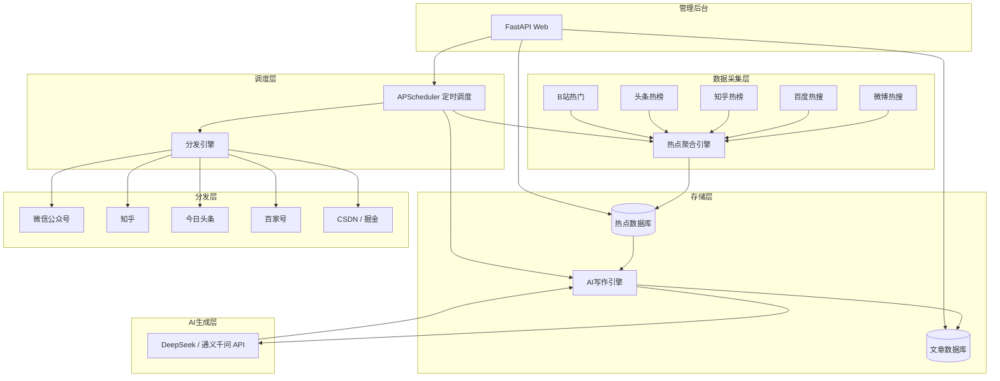
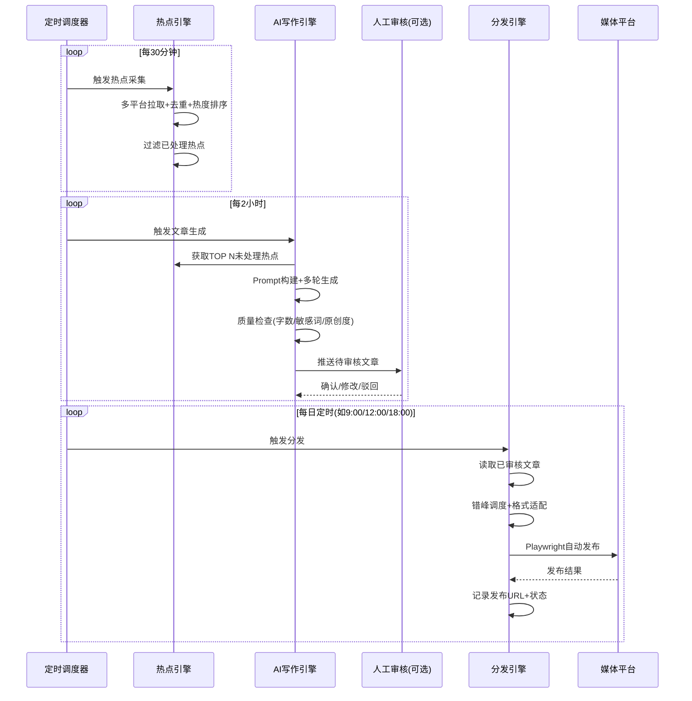

# 自媒体全自动写作、分发工作流设计方案

## 一、系统架构总览



---

## 二、核心工作流



---

## 三、核心模块设计

### 3.1 热点获取引擎

| 设计要点 | 说明 |
| ---------- | ------ |
| **数据源** | 微博热搜、百度热搜、知乎热榜、头条热榜、B站热门、抖音热点 |
| **采集方式** | 优先第三方聚合API；备选 Playwright 模拟 + BeautifulSoup 解析 |
| **去重策略** | 标题相似度 > 0.85 视为同一热点，合并热度值 |
| **热度计算** | 加权模型：微博热搜位次 × 0.3 + 百度指数 × 0.25 + 知乎热度 × 0.2 + 头条热度 × 0.25 |
| **保鲜机制** | 超过6小时的热点自动降权，超过24小时标记为过期 |
| **采集频率** | 每30分钟增量拉取 |

### 3.2 AI 写作引擎

| 设计要点 | 说明 |
| ---------- | ------ |
| **模型选择** | DeepSeek（性价比高）或通义千问（中文优化好） |
| **生成策略** | 热点信息 → 写作大纲 → 正文草稿 → 润色优化（多轮流水线） |
| **Prompt模板** | 深度分析体、快讯体、观点评论体、清单体、故事体，按热点类型自动匹配 |
| **质量门禁** | ① 字数 ≥ 800 ② 敏感词过滤 ③ 原创度检测 ④ 标题吸引力评分 |
| **文章风格** | 可配置人设（"产品经理独孤虾"视角），记忆历史文章风格保持一致 |

**Prompt 模板示例（深度分析体）：**

> 你是一位资深互联网产品经理，擅长从产品视角分析行业热点。请针对以下热点写一篇深度分析文章：
>
> 【热点标题】{title}
> 【热点背景】{context}
>
> 要求：
>
> 1. 开篇用产品经理的视角点出核心矛盾
> 2. 分析该热点背后的产品逻辑和用户需求
> 3. 提出3个可迁移的产品方法论
> 4. 结尾给出趋势判断
> 5. 字数1200-1500，口语化但不失专业深度

### 3.3 分发引擎

| 设计要点 | 说明 |
| ---------- | ------ |
| **实现方式** | Playwright 浏览器自动化 + 平台适配器模式 |
| **平台适配** | 每个平台独立 Adapter，封装登录态保持、格式转换、发布操作 |
| **发布调度** | 错峰发布（各平台间隔 ≥ 30分钟），模拟人类作息（9:00-22:00） |
| **操作模拟** | 随机打字速度、随机鼠标移动轨迹、操作间隔随机化 |
| **状态追踪** | 待发布 → 提交中 → 平台审核 → 已发布 → 记录URL |
| **异常处理** | 验证码识别（接打码平台）、登录态失效自动刷新、失败重试3次 |

### 3.4 调度引擎

| 任务 | 频率 | 说明 |
| ------ | ------ | ------ |
| 热点采集 | 每30分钟 | 高频，保证时效 |
| 热点分析+选题 | 每2小时 | 筛选适合创作的热点 |
| AI文章生成 | 每2小时 | 基于最新未处理热点 |
| 文章分发 | 每日3次 | 9:00 / 12:00 / 18:00 各发布1-2篇 |
| 数据回刷 | 每日1次 | 抓取已发布文章的阅读/点赞/评论数据 |

---

## 四、技术栈

```text
语言：          Python 3.11+
Web框架：       FastAPI（管理后台 + API）
任务调度：      APScheduler
浏览器自动化：  Playwright（替代 Selenium，更稳定）
AI接口：        DeepSeek API / 通义千问 API
数据库：        SQLite（轻量起步）→ PostgreSQL（规模化）
ORM：           SQLAlchemy
前端管理：      Vue 3 + Element Plus（可选，先用FastAPI自带的Swagger）
部署：          Docker + 一台低配云服务器即可
```

---

## 五、实施路线图

### V1.0 — 半自动化 MVP（1-2周）

- 热点采集：Python脚本手动运行，拉取微博+百度热搜
- 文章生成：手动复制热点到AI对话，人工引导生成
- 文章发布：手动复制粘贴到各平台
- **交付物**：验证流程可行性，积累Prompt模板

### V2.0 — 调度自动化 + 人工审核节点（2-4周）

- 热点采集全自动化（APScheduler定时拉取）
- AI写作接入API自动生成，产出草稿存入待审核队列
- 人工在管理后台审核/编辑/确认
- Playwright自动发布已确认文章
- **交付物**：可运行的自动化系统，人工把控质量

### V3.0 — 全自动化 + 数据闭环（4-8周）

- 取消人工审核节点（高质量模板可信任后）
- 发布后自动采集阅读/点赞/评论数据
- 数据反馈到选题策略（什么类型文章效果好就多写）
- 多账号管理、A/B标题测试
- **交付物**：完全无人值守的自媒体工作流

---

## 六、关键风险与应对

| 风险 | 影响 | 应对 |
| ------ | ------ | ------ |
| 平台封号 | 高 | 控制发布频率、模拟真人操作、从半自动逐步过渡 |
| AI内容同质化 | 中 | 多模板轮换、注入个人经历/观点、人工润色 |
| 热点时效已过 | 中 | 30分钟高频采集、生成到发布控制在2小时内 |
| 平台改版导致脚本失效 | 中 | 适配器模式解耦、Playwright录制快速修复 |
| API费用 | 低 | DeepSeek性价比极高，月均几十元即可 |
